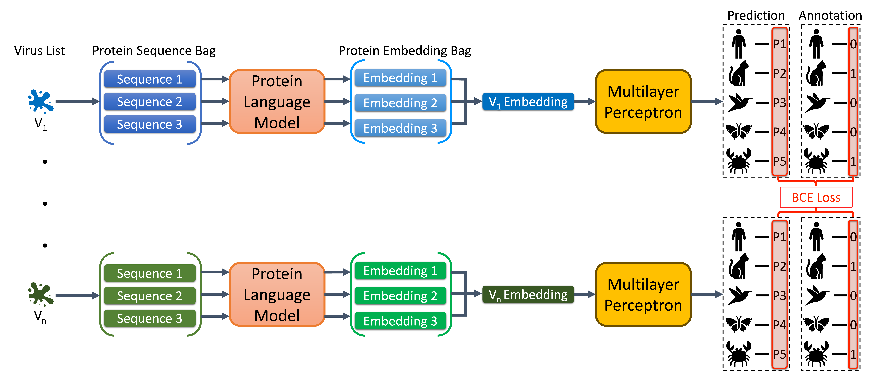

# VHPredictor

This is the implement of "VHPredictor: Protein Language Model-Based Virus Representations Insights into Virus-Host Interactions". 

Powered by a `protein language model`, VHPredictor rapidly and accurately predicts `interactions between viruses and hosts` using only the `virus proteins` as input.

## Quick links

* [Requirements](#requirements)
* [Data preparation](#data-preparation)
* [Reproduce all our experiments with only one file](#main)
* [Run VHPredictor locally](#pipeline)
* [Citation](#citation)

## Requirements

Follow the steps in [requirements.sh](requirements.sh)

## Data preparation

We have released our experiment data, which can be downloaded from [Zenodo](TODO).

## Reproduce all our experiments with only one file

- Reproduce all our experiments with good visualization by following the steps in [main.ipynb](main.ipynb)

**Notice: Detailed results are saved in** `vhpredictor_data/experiment/test_result/figure`.

## Run VHPredictor locally

- Run VHPredictor locally by following the example in [pipeline.ipynb](pipeline.ipynb)

**Notice: the inputs and outputs of the example are saved in** `example/`.

## Citation

TODO